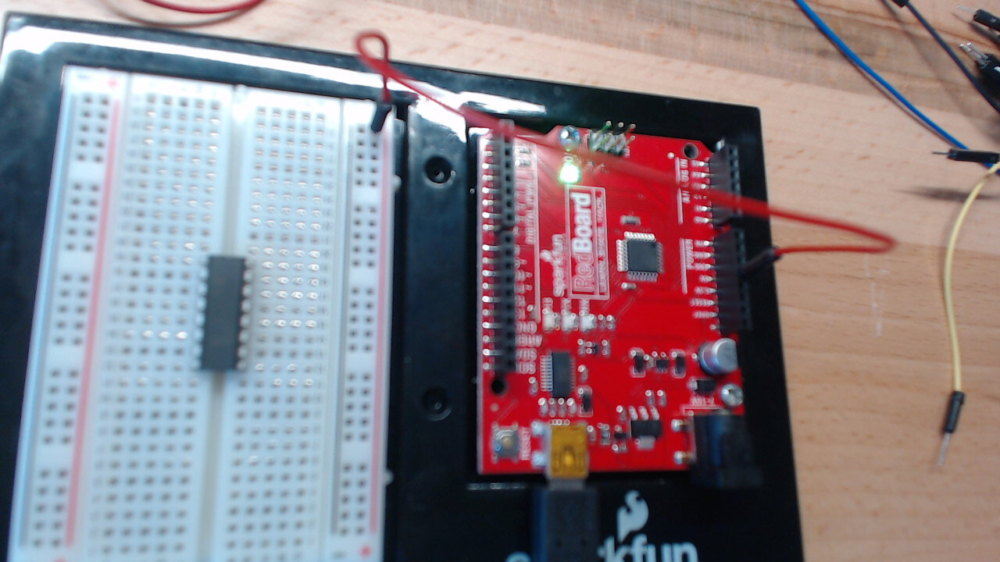
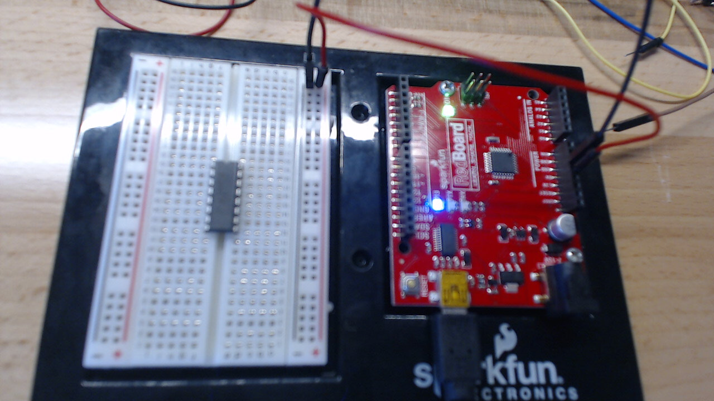
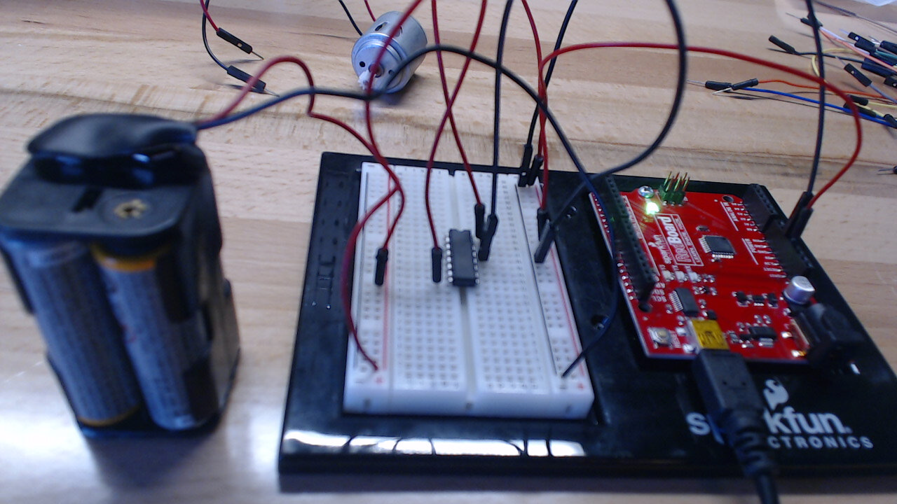
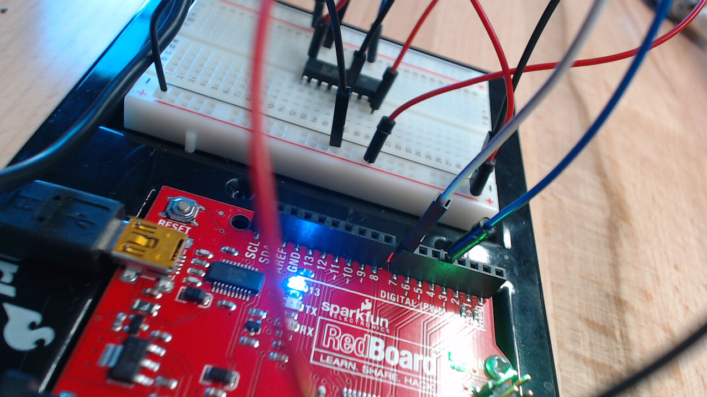
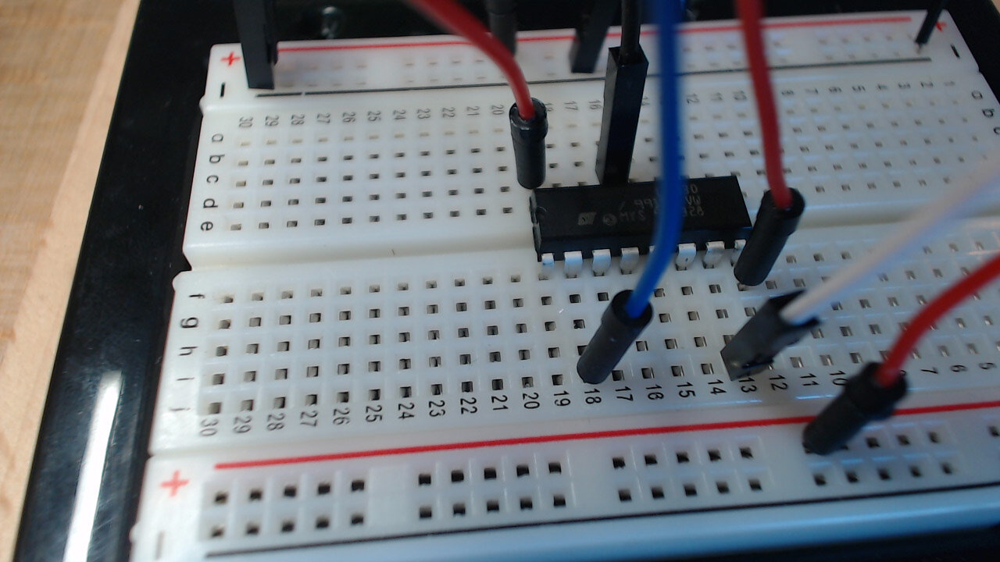
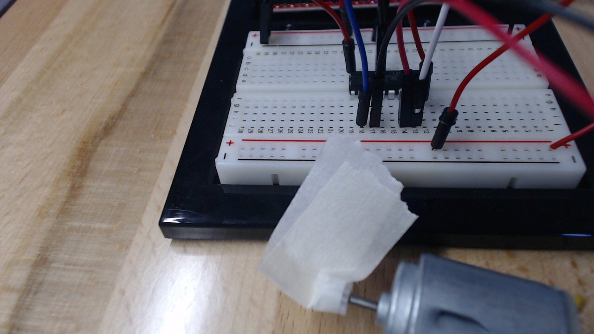
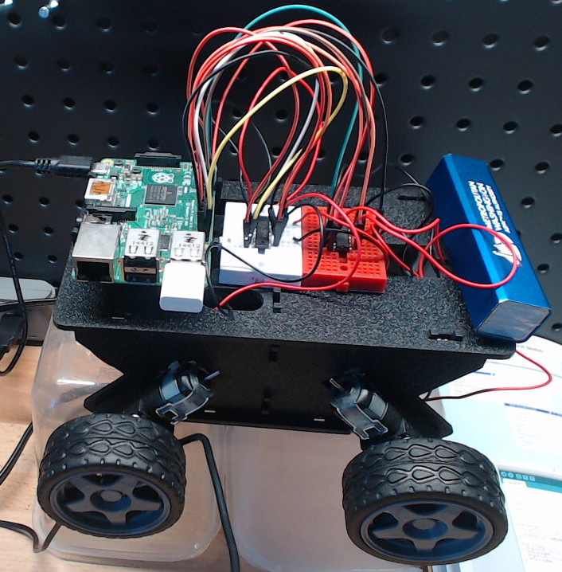

# Introduction
I am building a robot using one of my Raspberry Pi 2s. I bought a chasis that came with wheels and 4 motors. Figuring out how to control the motors seemed unnecessasrily difficult to figure out. I am not terribly familiar with electronic circuits and chips. 

I quickly learned that I need to master using the L239D chip to succeed. This is because a microcontroller cannot provide enough power to a motor for such an application directly. You need to use a separate battery back, and use the microcontroller to determine if and how the motor gets power from the batter. The L239D is a very popular chip for doing just that.

It took me too much trial and error to figure out how to use the L239D chip. So, I wrote this guide as the guide that I wish I had when I was learning how to set up my robot.

# Parts
To write this guide, I assembled the following components I had handy.

 1. Breadboard - For learning the wiring, a standard divided breadboard is easiest.
 2. Microcontroller - I used my Arduino clone from Sparkfun. It is the simplest to set up. Any microntroller like a Pi or BeagleBone will do just fine, though.
 3. Battery Pack - A 9 volt battery is fine. I happened to have a 4xAA battery holder handy, so I used that. 
 4. Jumper Cables - I strongly prefer to use red for negative, black for positive, and other colors for digital connections. Of course, use what you have handy.
 5. L293D Chip - I ordered 10 of them from Amazon for about $9.
 6. Motor - I had a small motor from my Sparkfun inventors kit handy. The motors for my robot are much more powerful, but this one was fine for the guide.


# Overview
1 - a port for powering the chip itself
2 - grounding the chip itself
3 - a port of getting power from the battery, uses the same ground
4. 4 input ports
 - one for postive, one for negative on each side
5. pwm control, not covered


# Install on Breadboard
 * Notch is the front
 * Divide if available


# Power the L293D
The chip itself needs power to run. This is separate from the power that will go the motor, and separate from the digital output to command whether to give juice to the motor. Your microcontrol almost certainly has a 5v out that is perfect for this. On the Arduino, it is conveniently labeled "5V."

I prefer to use red jumpers for positive power, and black for ground. After this step, your L29D will have the power it needs to run its logic.

## Connect the 5v Output
Use a red jumper to connect the 5v of your microcontroller to the power strip of the breadboard. 



## Ground the Breadboard
Next, ground the breadboard. This ground will be used by everything plugged into the L293D. Use a black jumper to connect the ground on the breadboard to the ground on your microcontroller.



## Complete the Power Circuit for the L293D
Now that the breadboard is set up, you can complete the circuit to the L293D.
1. Use a red jumper cable to connect pin 16 to the positive power channel in the breadboard.
2. Use a black jumper to connect pin 13 to the negative channel in the breadboard.


# Create the Circuit for the Battery
Next we will provide power for motor. The battery pack will provide the power to the motor (when commanded by the microcontroller). After this step, the batter will be wired up, but the motor still won't be connected, nor will the commands from the microcontroller.

Plug the red lead from the battery pack in the breadboards other positive channel. Then use a red jumper cable to connect from the positive channel to pin 8 on the L239D. This provides the power from the battery that will be used to control the motor.


Then connect the black lead from the battery into the ground channel from the other side. This will just use the existing ground on the microcontroller.



# Connect the Digital Pins
In this application, the motor is controller by digital pins that can be either on or off (usually called GPIO) pins. By connecting digital pins to the L239D, you can tell the L239D to allow electricity to flow through the motors red positive lead, or black negative lead. If the batter power flows through the red lead, the motor will go forward, if through the black lead, it will go backward. If electricity goes through either or both, the motor will not move. In this way, you need two inputs to fully control the direction of the motor.

I chose pins 7 and 4 on the Arduino due to their convenient placement. Use a jumper that is not black or red for each digital pin that you choose. 



Then connect them to the L239D inputs, but connecting them to pins 2 and 7. These are the 2 "input" pins on this side of L239D.



The L239D is now ready to receive commands.

# Connect the Motor
This is the last step in creating the cirtuits. You simply need to pair the red and black leads from the motor with the digital pin inputs, by connecting them to pins 3 and 6 on the L239D. This pairs them with the inputs on pin 2 and 7.



# Control with the Microcontroller
Now you can control the direction of the motor with the microcontroller. Here is an Arduino sketch that causes the motor to spin in one direction for 1 second. Then rests for a second, then spins the other way, and then rests, and so forth.

```
void setup() {
  // put your setup code here, to run once:
  pinMode(4, OUTPUT);
  pinMode(7, OUTPUT);

}

void loop() {
  // put your main code here, to run repeatedly:
  digitalWrite(4, HIGH);
  digitalWrite(7, LOW);
  delay(1000);
  digitalWrite(4, LOW);
  digitalWrite(7, LOW);
  delay(1000);
  digitalWrite(4, LOW);
  digitalWrite(7, HIGH);
  delay(1000);
}
```

# Next Steps
Note that you only used one side of the L239D. There are 2 more inputs and outputs (pins 15/14 and pins 10/11). That means that you can use the same L239D to control another motor. In my application, I use 2 L239Ds to control 4 wheels of my robot independently. 




