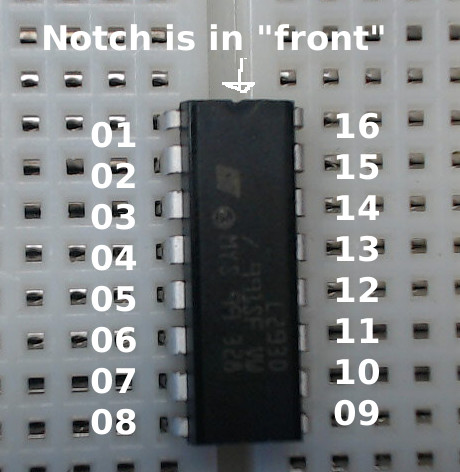

# Introduction
 * Applications
 * Not familiar with circuits
 * Couldn't find clear instructions
 * The guide I wish I had

# Parts
 * Breadboard
 * Computer (Arduino)
 * Battery Pack
 * Jumper Cables
 * L293D Chip
 * Motor

# Install on Breadboard
 * Notch is the front

  * Divide if available

# Overview
1 - a port for powering the chip itself
2 - grounding the chip itself
3 - a port of getting power from the battery, uses the same ground
4. 4 input ports
 - one for postive, one for negative on each side
5. pwm control, not covered

point to diagram

# Power the L293D
The chip itself needs power to run. This is separate from the power that will go the motor, and separate from the digital output to command whether to give juice to the motor. Your microcontrol almost certainly has a 5v out that is perfect for this. On the Arduino, it is conveniently labeled "5V."

I prefer to use red jumpers for positive power, and black for ground. After this step, your L29D will have the power it needs to run its logic.

## Connect the 5v Output
Use a red jumper to connect the 5v of your microcontroller to the power strip of the breadboard. 
!(Connect the 5v to the breadboard)[Photos/5v-breadboard.jpg)

## Ground the Breadboard
Next, ground the breadboard. This ground will be used by everything plugged into the L293D. Use a black jumper to connect the ground on the breadboard to the ground on your microcontroller.
!(Ground the breadboard)[Photos/ground-breadboard.jpg)

## Complete the Power Circuit for the L293D
Now that the breadboard is set up, you can complete the circuit to the L293D.
1. Use a red jumper cable to connect pin 16 to the positive power channel in the breadboard.
2. Use a black jumper to connect pin 13 to the negative channel in the breadboard.

!(Complete the circuit for the L239D)[Photos/5v-circuit.jpg)

# Power the Motor
